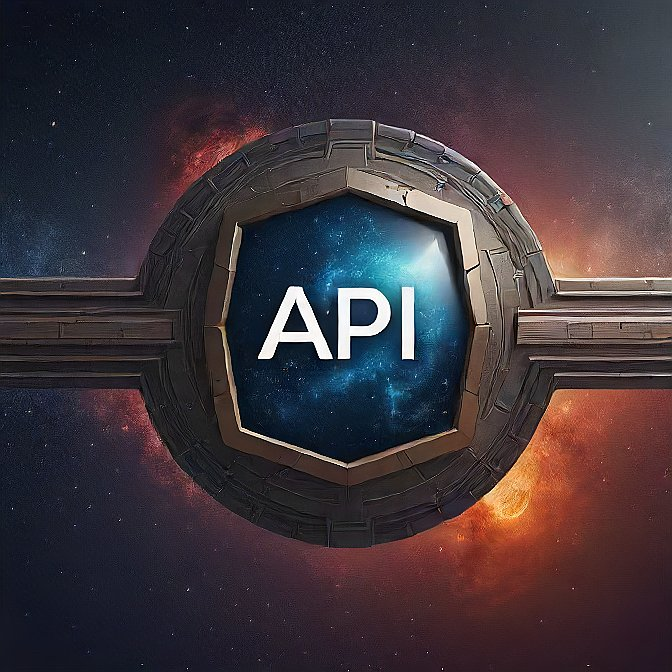

<div align="center">
    
</div>

# API Gateway

The **api-gateway** project is a scalable gateway for routing API requests to microservices. It features rate limiting, CORS configuration, and reverse-proxy.

## Features

- **Routing**: Route API requests to various microservices based on version and service function.
- **Rate Limiting**: Protect services from excessive requests with configurable limits.

## Prerequisites

- Node.js (v20.15.0 or later)
- Redis

## Installation

### 📦 Using Docker

1. **Clone the repository**:

   ```bash
   git clone https://github.com/LakshayManglani/api-gateway.git
   cd api-gateway
   ```

2. **Set up environment variables:**

   1. Create two environment files: `.env` for production and `.env.dev` for development.
   2. Copy the content of `.env.sample` into both `.env` and `.env.dev`.
   3. Replace the placeholder values with your actual environment credentials.

3. **Run the Docker containers:**

   For development:

   ```bash
   docker compose -f docker-compose.dev.yml up -d
   ```

   For production:

   ```bash
   docker compose up -d
   ```

### 💻 Running Locally

1. **Clone the repository**:

   ```bash
   git clone https://github.com/LakshayManglani/api-gateway.git
   cd api-gateway
   ```

2. **Install dependencies**:

   ```bash
   npm install
   ```

3. **Set up environment variables**:

   1. Create a `.env` file in the root directory.
   2. Copy the content from `.env.sample` into `.env`.
   3. Replace the placeholder values with your actual environment credentials.

4. **Start the service**:

   ```bash
   npm start
   ```

## How to Contribute

We welcome contributions from the community. Please follow these steps to contribute:

1. **Fork the repository**
2. **Create a new branch**:

   ```bash
   git checkout -b feat/feature-branch-name
   ```

3. **Make your changes and commit them**:

   ```bash
   git commit -m "feat(scope): description of changes"
   ```

4. **Push to the branch**:

   ```bash
   git push origin feat/feature-branch-name
   ```

5. **Create a pull request** detailing your changes.

For more details on the commit format and other guidelines, please refer to the [Contributor Guidelines](./CONTRIBUTING.md).

## License

This project is licensed under the MIT License - see the [LICENSE](LICENSE) file for details.

## Contact

For any inquiries or issues, please open an issue on GitHub or reach out to us using the following email addresses:

[@LakshayManglani](https://github.com/LakshayManglani):
**[lakshaymanglani2212@gmail.com](mailto:lakshaymanglani2212@gmail.com)**

---

Thank you for using our API Gateway! We hope it streamlines your service management.
